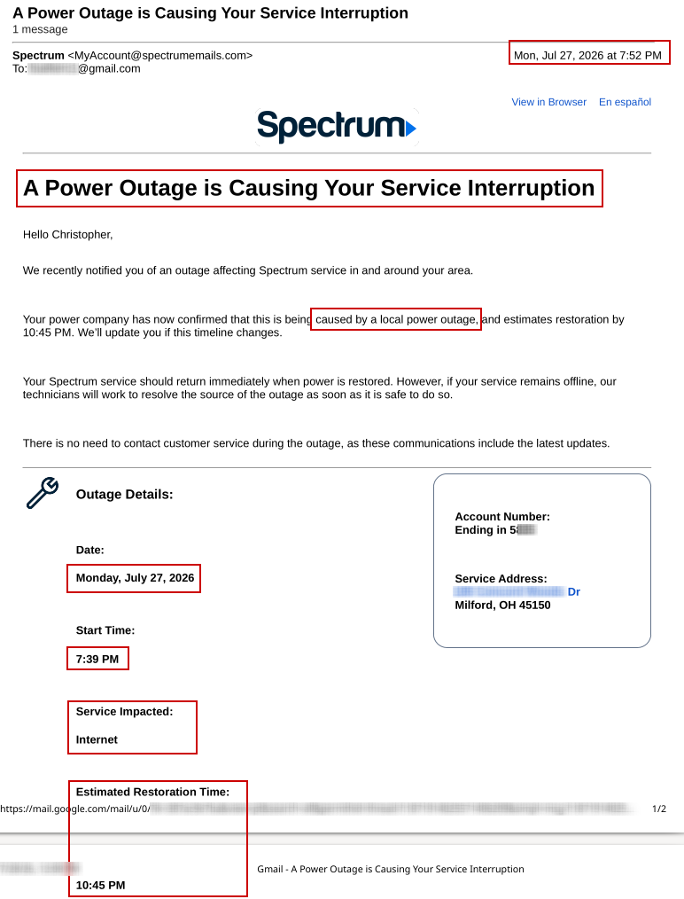
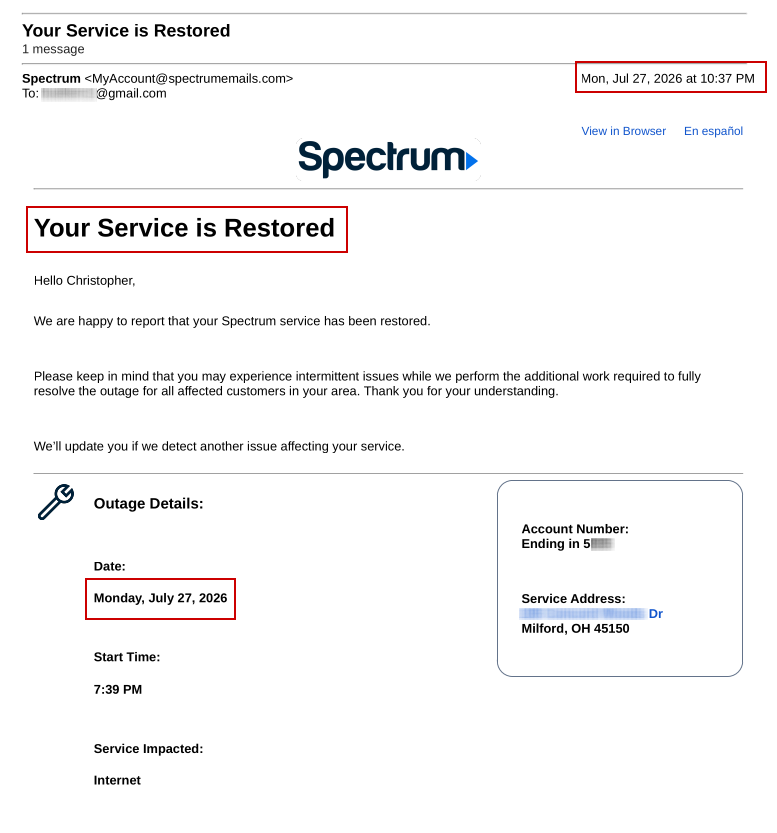
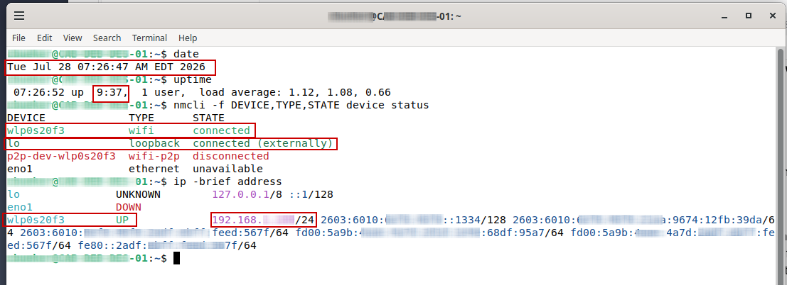
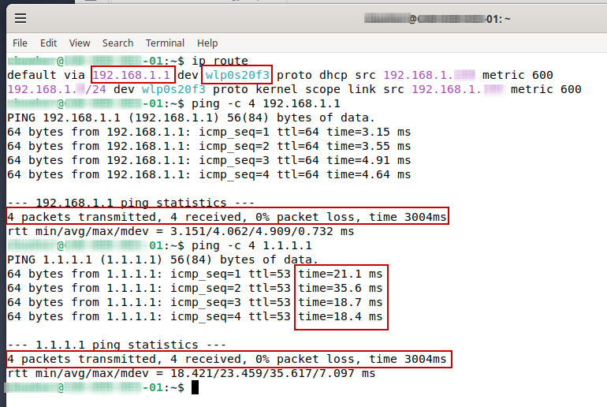
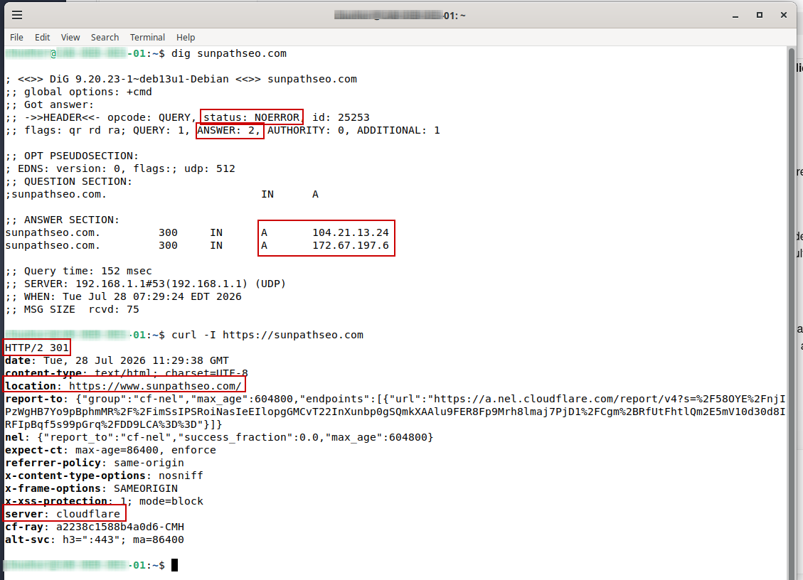

**Post-Incident Service Restoration Validation**

Post-incident validation of home Internet service restoration following a storm-related power outage using provider notifications and Debian network diagnostics.

On July 27, 2026, loud thunderstorms moved through the Milford, Ohio area while my wife and I were at home. At the time, I was working on a website and preparing for the decommissioning of my original website. The severe weather caused a power outage and an associated Spectrum Internet service interruption in our home. Spectrum reported that the interruption began at 7:39 PM, and I received the service-restoration notification at 10:37 PM.

The following morning, I conducted a structured post-incident validation from my Debian Linux workstation. I worked to confirm that local network connectivity, Internet access, DNS resolution, and HTTPS service access had recovered successfully. I documented my actions, evidence, findings, and conclusions in this repository.

**Provider Outage Notification**

- Reviewed the Spectrum outage notification received on July 27, 2026.
- Confirmed that Spectrum attributed the Internet service interruption to a local power outage.
- Recorded the reported outage start time of 7:39 PM.
- Recorded that Internet service was affected.
- Recorded the estimated restoration time of 10:45 PM.
- Preserved and sanitized the provider notification as supporting incident evidence.

**Provider Restoration Notification**

- Reviewed the Spectrum service restoration notification.
- Recorded that the restoration notification was received at 10:37 PM on July 27, 2026.
- Confirmed that Spectrum reported Internet service as restored.
- Noted that intermittent issues could continue while additional restoration work was completed.
- Preserved and sanitized the restoration notification as supporting recovery evidence.

**System and Interface Validation**

- Recorded the workstation date and time to establish when post-incident validation was performed.
- Checked system uptime to determine how long the Debian workstation had been operating after power restoration.
- Used NetworkManager to review network-device state.
- Confirmed that the wireless interface was connected.
- Reviewed interface addressing and confirmed that the workstation had received a valid private IPv4 address.
- Sanitized the workstation username, hostname, and IPv6 addressing before publication.

**Routing and Network Connectivity Validation**

- Reviewed the workstation routing table.
- Confirmed that a valid default route existed through the local network gateway.
- Tested connectivity to the local gateway using ICMP echo requests.
- Confirmed successful local gateway communication with zero packet loss.
- Tested external Internet connectivity using the public IP address 1.1.1.1.
- Confirmed successful external connectivity with zero packet loss.
- Compared local and external response times as part of the recovery validation.

**DNS and HTTPS Validation**

- Queried the SunPath SEO domain using the dig DNS utility.
- Confirmed that the DNS query completed successfully with a NOERROR response.
- Confirmed that two IPv4 address records were returned.
- Verified that the DNS request was processed through the local network gateway.
- Tested HTTPS availability using curl.
- Confirmed that the website returned an HTTP 301 permanent redirect.
- Confirmed that the redirect pointed to the expected www version of the domain.
- Confirmed that Cloudflare responded as the public-facing web service.

